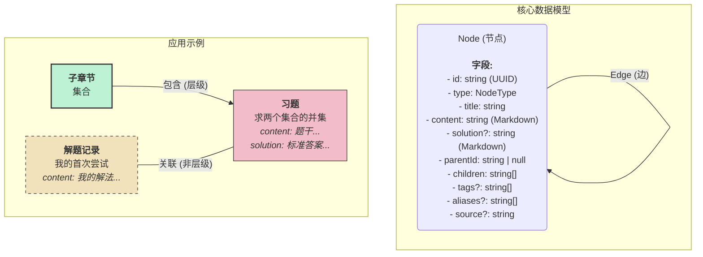

# 数学笔记：一个基于图的数学笔记应用

数学笔记是一款专为数学学生和爱好者设计的纯前端应用。它提供了一种结构化且灵活的方式来记录笔记、组织概念和练习题目，同时将所有数据安全地保存在您自己的浏览器中。

## 核心概念

本应用围绕一个基于图的数据模型构建，该模型优雅地处理了数学学科的层级结构以及概念之间复杂的相互联系。这种方法将每一条信息——从一个宽泛的数学分支到一个具体的定义或练习题——都视为图中的一个“节点”。

该模型由两个基本元素组成：

1.  **节点 (Node)**：内容的基本单元。一个节点可以是一个数学分支、一个主章节、一个子章节、一个定义、一个定理、一个例题、一条个人笔记或一道练习题。
2.  **边 (Edge)**：节点之间的连接。边代表关系，例如一个定理*引用*一个定义，或者一道练习题*关联于*一个章节。

### 数据结构可视化

下图说明了应用的核心数据模型，展示了一个节点包含的主要字段。



## 功能特性

*   **层级与网络化笔记**: 在传统的树状结构（分支 -> 章节 -> 小节）中组织笔记，同时通过“相关节点”功能，在任意两个条目之间创建丰富的非线性链接。
*   **完整的笔记操作**:
    *   **创建**: 在任意位置创建子节点或同级节点。
    *   **编辑**: 全功能的 Markdown 编辑器，支持 LaTeX 公式。
    *   **排序**: 通过“上移/下移”按钮调整节点在同级中的顺序。
    *   **删除**: 安全地删除节点及其所有关联。
*   **全局搜索**: 通过 `Cmd/Ctrl + F` 快速搜索所有节点的标题、内容、标签和别名。
*   **快捷键支持**: 提供了一套丰富的快捷键，以提升内容创作和浏览效率。
*   **本地优先**: 所有数据都使用 `IndexedDB` 存储在您的本地浏览器中，确保隐私和离线访问。
*   **导入/导出**: 通过导出和导入简单的 JSON 文件，轻松备份您的知识图谱或在设备之间移动它。

## 快捷键

| 快捷键 | 功能 | 作用域 |
| :--- | :--- | :--- |
| `Cmd/Ctrl + F` | 聚焦搜索框 | 全局 |
| `J` | 选中下一个节点 | 主内容区 |
| `K` | 选中上一个节点 | 主内容区 |
| `E` | 编辑选中的节点 | 主内容区 |
| `Cmd/Ctrl + S` | 保存更改 | 编辑模式 |
| `Esc` | 取消编辑 | 编辑模式 |

## 技术栈

这是一个使用现代 Web 技术构建的纯前端项目：

*   **框架**: [React](https://react.dev/) 与 [Vite](https://vitejs.dev/)
*   **语言**: [TypeScript](https://www.typescriptlang.org/)
*   **包管理器**: [Bun](https://bun.sh/)
*   **UI**: [shadcn/ui](https://ui.shadcn.com/) & [Tailwind CSS](https://tailwindcss.com/)
*   **状态管理**: [Zustand](https://zustand-demo.pmnd.rs/)
*   **本地数据库**: [Dexie.js](https://dexie.org/) (IndexedDB 包装器)

## 开始使用

1.  **安装依赖**:
    ```bash
    bun install
    ```
2.  **运行开发服务器**:
    ```bash
    bun dev
    ```
3.  在浏览器中打开 `http://localhost:5173` (或终端中显示的地址)。
