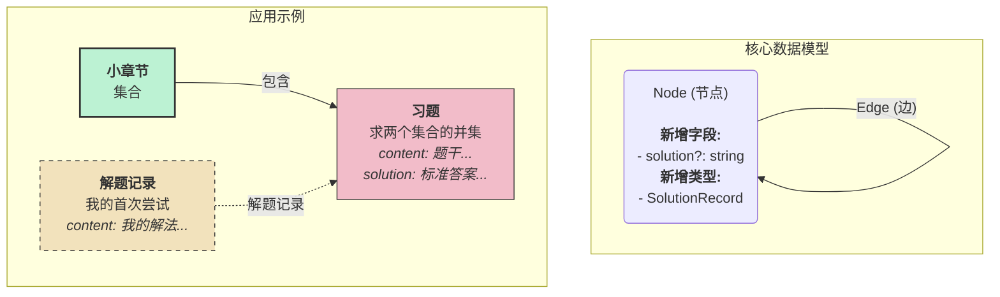

# 数学笔记：一个基于图的数学笔记应用

数学笔记是一款专为数学学生和爱好者设计的纯前端应用。它提供了一种结构化且灵活的方式来记录笔记、组织概念和练习题目，同时将所有数据安全地保存在您自己的浏览器中。

## 核心概念

本应用围绕一个基于图的数据模型构建，该模型优雅地处理了数学学科的层级结构以及概念之间复杂的相互联系。这种方法将每一条信息——从一个宽泛的数学分支到一个具体的定义或练习题——都视为图中的一个“节点”。

该模型由两个基本元素组成：

1.  **节点 (Node)**：内容的基本单元。一个节点可以是一个数学分支（例如，“数学分析”）、一个大章节、一个小节、一个定义、一个定理、一个例子、一条个人笔记或一道练习题。
2.  **边 (Edge)**：节点之间的连接。边代表关系，例如一个定理*引用*一个定义，或者一道练习题*关联于*一个章节。

### 数据结构可视化

下图说明了更新后的数据模型，其中包含了用于存放标准答案的 `solution` 字段，以及新增的 `SolutionRecord`（解题记录）节点类型。

## 功能特性

*   **层级与网络化笔记**: 在传统的树状结构（分支 -> 章节 -> 小节）中组织笔记，同时在任意两个条目之间创建丰富的非线性链接。
*   **Markdown 支持**: 使用 Markdown 编写您的所有内容，包括复杂的 LaTeX 方程。
*   **本地优先**: 所有数据都使用 `IndexedDB` 存储在您的本地浏览器中，确保隐私和离线访问。
*   **导入/导出**: 通过导出和导入简单的 JSON 文件，轻松备份您的知识图谱或在设备之间移动它。
*   **统一内容**: 笔记、定义、定理和练习题都在同一个系统中管理，实现了无缝的交叉引用。

## 技术栈

这是一个使用现代 Web 技术构建的纯前端项目：

*   **框架**: [React](https://react.dev/) 与 [Vite](https://vitejs.dev/)
*   **语言**: [TypeScript](https://www.typescriptlang.org/)
*   **包管理器**: [Bun](https://bun.sh/)
*   **UI**: [shadcn/ui](https://ui.shadcn.com/) & [Tailwind CSS](https://tailwindcss.com/)

## 开始使用

*（此部分稍后将填写有关如何设置和运行项目的说明。）*
